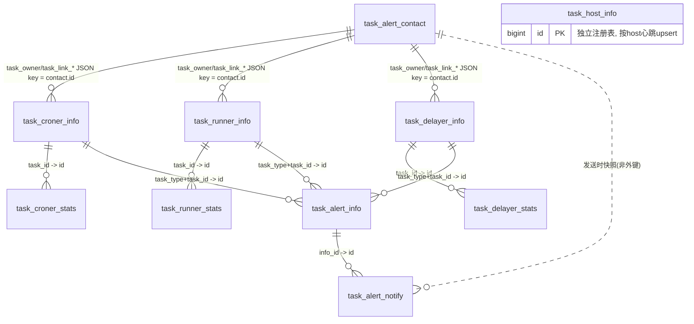

# uw_task 数据库设计文档

> 依据：`uw_task.sql`（13 张表），
> 并对照 `src/main/java/uw/task/center` 下实际代码（TaskRpcController、各 Report Controller、
> AlertProcessService、AlertNotifyScanCroner、TaskHostCleanCroner 等）确认逻辑外键与分表行为。

## 1. 库概述

`uw_task` 是 uw-task-center（内部任务调度中心）的数据库，管理三类异步任务的配置、运行统计、主机注册与报警：

| 任务类型 | 调度方式 | 配置表 | 统计表 |
|---|---|---|---|
| croner（定时任务） | cron 表达式触发 | `task_croner_info` | `task_croner_stats` |
| runner（队列任务） | MQ 队列消费 | `task_runner_info` | `task_runner_stats` |
| delayer（延迟任务） | 延迟队列（runAt 到期消费） | `task_delayer_info` | `task_delayer_stats` |

外加：

- `task_host_info`：任务宿主机注册与心跳聚合（每主机一行，含三类任务的累计统计与 JVM/线程指标）。
- `task_alert_info` / `task_alert_notify` / `task_alert_contact`：报警事件、待发送通知、联系人三张报警链路表。
- `sys_crit_log` / `sys_data_history` / `sys_seq`：uw 框架公共表（关键日志、数据修改历史、ID 发号序列），非 task-center 专属业务。

库内**全部为逻辑外键，无物理外键约束**（uw 项目统一约定），主键 `id` 由 `sys_seq` 发号（`dao.getSequenceId`）。

## 2. 表用途与关键字段

### 2.1 task_croner_info（定时任务配置）

- 关键字段：`task_class` + `task_param` + `run_target` 三元组唯一标识一个注册实例（心跳按此 upsert，见 `TaskRpcController:427`，补充索引 `idx_class_target_param`）；`task_cron` cron 表达式；`next_run_date` 下次执行时间；`run_type/run_target` 运行目标。
- 内嵌累计统计列：`stats_date / stats_run_num / stats_fail_num / stats_run_time`。
- 内嵌报警阈值列：`alert_fail_rate`（总失败率）、`alert_fail_partner_rate / alert_fail_data_rate / alert_fail_program_rate / alert_fail_config_rate`（四类失败分率）、`alert_wait_timeout / alert_run_timeout`。
- 联系人：`task_owner`、`task_link_our`、`task_link_mch`（JSON 形如 `{"<contactId>":"<contactName>"}`，指向 `task_alert_contact.id`）。
- `state`：1 正常 / 0 暂停 / -1 标记删除。

### 2.2 task_runner_info（队列任务配置）

与 croner 对称，差异点：

- 身份三元组为 `task_class + task_tag + run_target`（`idx_class_target_tag`）。
- 消费配置：`queue_type`、`delay_type`、`consumer_num`、`prefetch_num`。
- 限速/重试：`rate_limit_type/value/time/wait`、`retry_times_by_overrated/partner/program`。
- 队列专属报警：`alert_queue_oversize`（队列长度）、`alert_queue_timeout`（队列等待）。
- 无 cron/next_run_date。

### 2.3 task_delayer_info（延迟任务配置）

与 runner 近对称（同为 tag 标识 + 消费线程/限速/重试配置），差异点：

- 无 `queue_type/delay_type`（固定延迟队列），新增 `poll_interval`（poll 间隔秒）。
- `alert_wait_timeout` 语义特化为"实际执行晚于 runAt 的平均毫秒"。
- 无 runner 的 `alert_queue_oversize/queue_timeout`。

### 2.4 task_croner_stats / task_runner_stats / task_delayer_stats（运行统计，按天分表）

- 结构对称：`task_id`（→ 对应 `*_info.id`）、`num_all`、四类失败计数 `num_fail_program/config/data/partner`、`time_run`。
- 差异字段：croner `time_wait`；runner `time_wait_queue / time_wait_delay / queue_size / consumer_num`；delayer `time_wait`（runAt→consume 延迟）、`queue_size / consumer_num`。
- 由客户端 RPC 上报，服务端经 `ShardingTableUtils.getTableNameByDate("task_xxx_stats", createDate)` 写入按天分表 `task_xxx_stats_yyyyMMdd`；报表经 `unionAllShards` 跨天 UNION ALL 后外层聚合。

### 2.5 task_host_info（任务宿主机）

- 每个运行 task 的应用实例一行，按 `id` 定位做心跳 UPDATE（WHERE 仅按 id，易变字段放 SET，避免误插重复行）。
- 聚合三类任务的 `*_num / *_run_num / *_fail_num / *_run_time` 十二列 + `jvm_mem_max/total/free`、`thread_active/peak/daemon/started`。
- 生命周期：`TaskHostCleanCroner` 对 `last_update` 超时且 `state=1` 的主机置 `state=-1`（软删）；恢复上报时 UPDATE 分支自愈 `state=-1→1`（`idx_state_last_update`）。

### 2.6 task_alert_info（报警事件）

- 一次报警一行：`task_type`（croner/runner/delayer）+ `task_id`（→ 对应 `*_info.id`，`idx_task_id`）+ `alert_title / alert_body / state`。

### 2.7 task_alert_notify（报警通知待发队列）

- `info_id` → `task_alert_info.id`（逻辑外键）；发送时从 contact 快照 `contact_man / contact_type / contact_info` 到本行（**与 contact 表脱耦，历史通知不因联系人改配置而变化**）。
- 生命周期（AlertNotifyScanCroner）：state=0 落库 → 原子抢占 `state 0→1`（`where state=0 and sent_times=0`）→ 扫描发送 `where state=1 and sent_times=0`（同时兼收上次实例崩溃孤儿）→ 发送成功置 `sent_times=1, sent_date=now()`。抢占 UPDATE 与扫描 SELECT 均由 `idx_state_sent(state, sent_times)` 覆盖；`info_id` 反查由 `idx_info_id` 覆盖。

### 2.8 task_alert_contact（报警联系人）

- 独立配置表：`contact_name / mobile / email / wechat / im / notify_url`。
- 与任务表的关联是**反向**的：`*_info.task_owner / task_link_our / task_link_mch` 中 JSON 的 key 即 `task_alert_contact.id`；AlertProcessService 解析后 `select * from task_alert_contact where id in (...) and state=1`（`idx_name_state` 覆盖按名查询）。

### 2.9 sys_* 框架公共表

- `sys_crit_log`：关键操作审计日志（含 saas_id/mch_id/user_*、请求响应全文）。**注意：结合 crit_log 治理结论，实际 DDL 以当前 uw_code.sql 为准。**
- `sys_data_history`：实体修改历史（entity_class + entity_id + entity_data JSON + 修改信息），供 OPS 追溯。
- `sys_seq`：ID 发号序列（seq_name 主键，seq_id 当前值，increment_num 步长），是全库所有 `id` 的来源，绝对不可分表。

## 3. 表间关系图（逻辑外键，无物理约束）

说明：

- 三个 `*_info` 与对应 `*_stats` 是标准的 1:N 父子关系（一任务一天/多次统计上报）。
- `task_alert_info` 通过**多态关联**（task_type 区分 + task_id）同时指向三张 info 表。
- `task_alert_contact` 与 info 表的关联是**反向 JSON 引用**（info 行里存 contact id 集合），不是 contact 行里存 task id。
- `task_host_info` 无外键：主机按注册 upsert 独立成表，与 info 表仅在 `run_target/task_project` 维度上业务对应。

## 4. saas_id 归属分析

- **task_* 全部 10 张表均无 saas_id 字段**——这是正确的语义：uw-task 是内部任务调度基础设施，任务/主机/报警不属于任何 SaaS 租户，配置是全局唯一的。
- 仅两张 `sys_*` 审计表带 `saas_id / mch_id / user_id`（sys_crit_log、sys_data_history），因为它们记录的是"哪个用户在 OPS 界面做了什么操作"，操作者带租户身份，而任务本身不带。
- `sys_seq` 无 saas_id，全局发号。
- 结论：本库 **saas_id 语义不存在 / 不需要**，不要以"缺少 saas_id"为由加列或分租户分表。

## 5. 分表评估（重点）

### 5.1 已实施：task_{croner,runner,delayer}_stats 按天分表

- **现状**：写入按 `create_date` 落到 `task_xxx_stats_yyyyMMdd`；查询用 `ShardingTableUtils.unionAllShards` 跨天 UNION ALL 再聚合；索引 `idx_task_date(task_id, create_date)` 需逐分表执行。
- **合理性**：stats 是全库唯一无界增长的业务数据（每次上报一行，高频任务每天可达十万~百万行级）。按天分表：
  1. 单表体量封顶为一天写入量，B+ 树深度可控；
  2. 报表查询天然带日期范围，分片裁剪精准；
  3. 历史数据可整表 DROP/归档，无 DELETE 开销。
- **代价/注意**：跨天报表需 UNION ALL 拼接。

### 5.2 需评估：task_alert_info / task_alert_notify 增长

- 增长模型：每次任务指标越限产生 1 条 alert_info + 每个联系人 1 条 alert_notify。常态下任务稳定运行时几乎零增长；**报警风暴场景**（某任务连续失败 + 阈值敏感）下单任务每天可产生数百~数千条。
- **结论：暂不分表，但需配套清理策略**。理由：
  1. 正常增长为低速数据，年增量估算在百万行以内，单表 InnoDB 完全可承载；
  2. alert_notify 是扫描驱动（`where state=1 and sent_times=0`），分表会让 AlertNotifyScanCroner 的全分表扫描复杂化，得不偿失；
  3. 真正的风险是**历史报警永不清理**。建议增加清理 Crone（参照 TaskHostCleanCroner 模式）：定期删除/归档 `create_date` 早于 N 天（如 90 天）且已发送（sent_times>0）的 alert_notify 及无引用的 alert_info，配合已有 `idx_task_id` / `idx_state_sent`。若未来接入大规模任务量，可再按月分表（按月而非按天，因量级远低于 stats）。

### 5.3 不需要分表：task_{croner,runner,delayer}_info、task_host_info、task_alert_contact

- 三张 info 是**配置表**：行数 = 注册任务数，量级为几十~几千行，且心跳 UPDATE 高频按主键/索引命中，分表只会破坏 upsert 简单性。`task_param/task_tag/run_target` 唯一性校验也依赖单表可见性。
- `task_host_info`：行数 = 宿主机数（几十级），同理。
- `task_alert_contact`：联系人配置，行数为个位~几十，永不增长。

### 5.4 sys_* 框架表

- `sys_crit_log` / `sys_data_history`：理论上是增长表，但属于 uw 框架公共规范表，是否分表由框架统一决策，不在 task-center 库内单独处理；现有 saas_id/biz_type/entity_class/时间索引已覆盖查询。
- `sys_seq`：发号器核心，短行高并发 UPDATE，绝不可分表。
